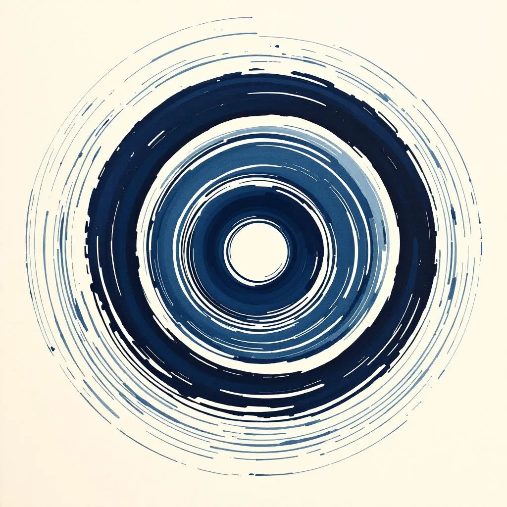

# Visual Specification: Code-Generated Art for Sol Therapy Website

> **Agent:** Illustrator
> **Date:** 2026-02-12
> **For:** CTO (implementation)
> **Status:** Complete
> **MERGE_KEY:** visual_specs

---

## Design Philosophy

Every element in this specification follows three principles drawn from the art direction research and the brand's Sumi-e / Neo-Japonism identity:

1. **Code IS the illustration.** No raster images. SVG paths and CSS gradients are the brushstrokes.
2. **Restraint IS sophistication.** Think Muji, Aman. Every value here has been calibrated for subtlety.
3. **Organic, not geometric.** Every curve is asymmetric and calligraphic. Nothing is mirrored or mathematically perfect.

The feeling we are creating: standing at the edge of a misty valley at dawn. The mountains dissolve into haze. The air is still. Something is breathing.

---

## A. Hero SVG Mountain Parallax (Priority 1)

### Concept

Three mountain silhouette layers at the bottom of the hero section. They overlap and recede into mist using atmospheric perspective (lighter/more transparent = farther). The edges are organic and calligraphic - irregular curves that feel like a single brushstroke dragged across wet paper.

These mountains sit BELOW the hero content and ABOVE the bokashi gradient. They are the visual anchor that grounds the entire page.

### SVG Code - Layer 1: Far Mountains (lightest, slowest parallax)

```html
<svg class="hero__mountain hero__mountain--far" viewBox="0 0 1440 320" preserveAspectRatio="none" aria-hidden="true">
  <path d="M0,320 L0,248 C48,230 96,215 168,228 C240,241 288,210 360,195 C432,180 504,220 576,232 C648,244 696,198 780,178 C864,158 936,210 1008,224 C1080,238 1128,196 1200,186 C1272,176 1344,218 1392,240 L1440,262 L1440,320 Z"
        fill="var(--indigo-light)" fill-opacity="0.12"/>
</svg>
```

### SVG Code - Layer 2: Mid Mountains (medium)

```html
<svg class="hero__mountain hero__mountain--mid" viewBox="0 0 1440 320" preserveAspectRatio="none" aria-hidden="true">
  <path d="M0,320 L0,270 C72,258 120,218 192,198 C264,178 312,238 408,252 C504,266 552,192 648,172 C744,152 816,218 888,240 C960,262 1032,198 1104,178 C1176,158 1224,212 1296,238 C1368,264 1416,282 1440,290 L1440,320 Z"
        fill="var(--indigo)" fill-opacity="0.18"/>
</svg>
```

### SVG Code - Layer 3: Near Mountains (darkest, fastest parallax)

```html
<svg class="hero__mountain hero__mountain--near" viewBox="0 0 1440 320" preserveAspectRatio="none" aria-hidden="true">
  <path d="M0,320 L0,286 C60,278 108,248 180,234 C252,220 324,268 396,282 C468,296 528,228 612,210 C696,192 768,252 852,268 C936,284 996,224 1068,208 C1140,192 1200,248 1272,270 C1344,292 1404,304 1440,310 L1440,320 Z"
        fill="#1B2F34" fill-opacity="0.28"/>
</svg>
```

### CSS Positioning and Parallax

```css
/* === HERO MOUNTAIN LAYERS === */
.hero__mountain {
    position: absolute;
    bottom: 0;
    left: 0;
    width: 110%;
    left: -5%;
    height: auto;
    pointer-events: none;
    z-index: 1;
    will-change: transform;
}

.hero__mountain--far {
    z-index: 1;
    /* Tallest layer, furthest back */
    min-height: 220px;
}

.hero__mountain--mid {
    z-index: 2;
    min-height: 200px;
}

.hero__mountain--near {
    z-index: 3;
    min-height: 180px;
}

/* Hero content must sit above mountains */
.hero__content {
    position: relative;
    z-index: 5;
}

/* Bokashi sits above mountains to create mist effect */
.hero__bokashi {
    z-index: 4;
}

/* Scroll indicator above everything */
.hero__scroll {
    z-index: 6;
}
```

### Parallax JavaScript

```javascript
// Mountain parallax on scroll
const mountainFar = document.querySelector('.hero__mountain--far');
const mountainMid = document.querySelector('.hero__mountain--mid');
const mountainNear = document.querySelector('.hero__mountain--near');

function updateMountainParallax() {
    const scrollY = window.scrollY;
    const heroHeight = document.querySelector('.hero').offsetHeight;

    // Only animate while hero is in view
    if (scrollY < heroHeight * 1.2) {
        const progress = scrollY / heroHeight;

        // Far layer: slowest movement (0.03x scroll speed)
        if (mountainFar) {
            mountainFar.style.transform = `translateY(${scrollY * -0.03}px)`;
        }
        // Mid layer: medium movement (0.06x)
        if (mountainMid) {
            mountainMid.style.transform = `translateY(${scrollY * -0.06}px)`;
        }
        // Near layer: fastest movement (0.10x)
        if (mountainNear) {
            mountainNear.style.transform = `translateY(${scrollY * -0.10}px)`;
        }
    }
}

window.addEventListener('scroll', updateMountainParallax, { passive: true });
```

### DOM Placement

Insert the three SVG elements INSIDE `.hero`, AFTER `.hero__bg` and BEFORE `.hero__bokashi`:

```html
<section class="hero" id="hero">
    <div class="hero__bg" aria-hidden="true"></div>

    <!-- Mountain parallax layers -->
    <svg class="hero__mountain hero__mountain--far" ...></svg>
    <svg class="hero__mountain hero__mountain--mid" ...></svg>
    <svg class="hero__mountain hero__mountain--near" ...></svg>

    <div class="hero__content">...</div>
    <div class="hero__scroll" ...>...</div>
    <div class="hero__bokashi" aria-hidden="true"></div>
</section>
```

### Design Notes

- The width is 110% with -5% left offset so the mountains bleed past viewport edges - no visible seams at screen boundaries
- `preserveAspectRatio="none"` ensures the paths stretch to fill the full width regardless of viewport
- Parallax speeds are deliberately slow (0.03, 0.06, 0.10) - this is a meditation website, not a game. The movement should be barely perceptible until you look for it
- The far layer is 12% opacity, mid is 18%, near is 28% - this creates atmospheric perspective without competing with the hero text
- Color choice: `--indigo-light` for far, `--indigo` for mid, `#1B2F34` (a shade darker than indigo) for near - subtle depth within a narrow tonal range

---

## B. Organic Section Transitions (Priority 2)

### B1. Hero Bokashi - Replace linear-gradient with SVG ink mask

Replace the current `.hero__bokashi` linear gradient with an SVG mask that has irregular, ink-wash edges.

**Current code to replace:**
```css
.hero__bokashi {
    position: absolute;
    bottom: 0;
    left: 0;
    right: 0;
    height: 30vh;
    background: linear-gradient(to bottom, transparent, var(--washi));
    pointer-events: none;
}
```

**New code:**
```css
.hero__bokashi {
    position: absolute;
    bottom: 0;
    left: 0;
    right: 0;
    height: 35vh;
    background: var(--washi);
    pointer-events: none;
    z-index: 4;
    -webkit-mask-image: url("data:image/svg+xml,%3Csvg xmlns='http://www.w3.org/2000/svg' viewBox='0 0 1440 400'%3E%3Cdefs%3E%3ClinearGradient id='fade' x1='0' y1='0' x2='0' y2='1'%3E%3Cstop offset='0%25' stop-color='black' stop-opacity='0'/%3E%3Cstop offset='35%25' stop-color='black' stop-opacity='0.3'/%3E%3Cstop offset='100%25' stop-color='black' stop-opacity='1'/%3E%3C/linearGradient%3E%3Cfilter id='rough'%3E%3CfeTurbulence type='fractalNoise' baseFrequency='0.015' numOctaves='3' seed='2'/%3E%3CfeDisplacementMap in='SourceGraphic' scale='35'/%3E%3C/filter%3E%3C/defs%3E%3Crect width='1440' height='400' fill='url(%23fade)' filter='url(%23rough)'/%3E%3C/svg%3E");
    mask-image: url("data:image/svg+xml,%3Csvg xmlns='http://www.w3.org/2000/svg' viewBox='0 0 1440 400'%3E%3Cdefs%3E%3ClinearGradient id='fade' x1='0' y1='0' x2='0' y2='1'%3E%3Cstop offset='0%25' stop-color='black' stop-opacity='0'/%3E%3Cstop offset='35%25' stop-color='black' stop-opacity='0.3'/%3E%3Cstop offset='100%25' stop-color='black' stop-opacity='1'/%3E%3C/linearGradient%3E%3Cfilter id='rough'%3E%3CfeTurbulence type='fractalNoise' baseFrequency='0.015' numOctaves='3' seed='2'/%3E%3CfeDisplacementMap in='SourceGraphic' scale='35'/%3E%3C/filter%3E%3C/defs%3E%3Crect width='1440' height='400' fill='url(%23fade)' filter='url(%23rough)'/%3E%3C/svg%3E");
    -webkit-mask-size: 100% 100%;
    mask-size: 100% 100%;
    -webkit-mask-repeat: no-repeat;
    mask-repeat: no-repeat;
}
```

**What this does:** Instead of a clean linear gradient, the mask uses `feTurbulence` to create irregular, organic edges - like ink bleeding on wet paper. The transition from hero indigo to cream washi will feel like watercolor, not Photoshop.

**Fallback:** If the inline SVG data URI causes issues in any browser, fall back to:
```css
.hero__bokashi {
    /* Fallback: multi-stop gradient approximation */
    background: linear-gradient(to bottom,
        transparent 0%,
        rgba(242,234,211,0.05) 15%,
        rgba(242,234,211,0.2) 30%,
        rgba(242,234,211,0.5) 50%,
        rgba(242,234,211,0.8) 70%,
        var(--washi) 100%
    );
}
```

### B2. Wave Divider - Replace static image with self-drawing SVG brushstroke

Replace the current `.wave-divider` (which uses a webp image at 6% opacity) with an SVG brushstroke that draws itself on scroll.

**New HTML (replaces the existing `.wave-divider` div):**
```html
<div class="wave-divider" aria-hidden="true">
    <svg class="brushstroke-divider" viewBox="0 0 1200 24" preserveAspectRatio="none">
        <path class="brushstroke-divider__path"
              d="M0,12 C40,8 80,16 140,11 C200,6 260,18 340,13 C420,8 480,16 560,12 C640,8 720,17 800,11 C880,5 940,16 1020,13 C1100,10 1160,14 1200,12"
              fill="none"
              stroke="var(--green)"
              stroke-opacity="0.10"
              stroke-width="2.5"
              stroke-linecap="round"
              stroke-linejoin="round"/>
    </svg>
</div>
```

**CSS:**
```css
.wave-divider {
    padding: 2rem 0;
    display: flex;
    justify-content: center;
    overflow: hidden;
}

.brushstroke-divider {
    width: 80%;
    max-width: 900px;
    height: 24px;
}

.brushstroke-divider__path {
    stroke-dasharray: 1800;
    stroke-dashoffset: 1800;
    transition: stroke-dashoffset 2.5s var(--ease-ink);
}

.wave-divider.is-visible .brushstroke-divider__path {
    stroke-dashoffset: 0;
}
```

**Trigger:** Use the existing IntersectionObserver to add `is-visible` class when the divider enters the viewport.

**Design notes:**
- The path mimics an actual calligraphy brushstroke - an uneven, flowing horizontal line with slight undulations
- 10% opacity in green matches the subtle, restrained aesthetic
- stroke-width 2.5 with round linecaps gives the feeling of a brush with slight pressure variation
- The self-drawing animation (stroke-dasharray trick) creates the Sumi-e feeling of watching ink flow onto paper

### B3. Bokashi-to-Dark (cream to indigo) - Organic ink mask

**Replace current:**
```css
.bokashi-to-dark {
    height: 20vh;
    background: linear-gradient(to bottom, var(--washi), var(--indigo));
}
```

**New code:**
```css
.bokashi-to-dark {
    height: 25vh;
    background: var(--indigo);
    -webkit-mask-image: url("data:image/svg+xml,%3Csvg xmlns='http://www.w3.org/2000/svg' viewBox='0 0 1440 300'%3E%3Cdefs%3E%3ClinearGradient id='bk1' x1='0' y1='0' x2='0' y2='1'%3E%3Cstop offset='0%25' stop-color='black' stop-opacity='0'/%3E%3Cstop offset='40%25' stop-color='black' stop-opacity='0.4'/%3E%3Cstop offset='100%25' stop-color='black' stop-opacity='1'/%3E%3C/linearGradient%3E%3Cfilter id='rgh1'%3E%3CfeTurbulence type='fractalNoise' baseFrequency='0.012' numOctaves='4' seed='5'/%3E%3CfeDisplacementMap in='SourceGraphic' scale='28'/%3E%3C/filter%3E%3C/defs%3E%3Crect width='1440' height='300' fill='url(%23bk1)' filter='url(%23rgh1)'/%3E%3C/svg%3E");
    mask-image: url("data:image/svg+xml,%3Csvg xmlns='http://www.w3.org/2000/svg' viewBox='0 0 1440 300'%3E%3Cdefs%3E%3ClinearGradient id='bk1' x1='0' y1='0' x2='0' y2='1'%3E%3Cstop offset='0%25' stop-color='black' stop-opacity='0'/%3E%3Cstop offset='40%25' stop-color='black' stop-opacity='0.4'/%3E%3Cstop offset='100%25' stop-color='black' stop-opacity='1'/%3E%3C/linearGradient%3E%3Cfilter id='rgh1'%3E%3CfeTurbulence type='fractalNoise' baseFrequency='0.012' numOctaves='4' seed='5'/%3E%3CfeDisplacementMap in='SourceGraphic' scale='28'/%3E%3C/filter%3E%3C/defs%3E%3Crect width='1440' height='300' fill='url(%23bk1)' filter='url(%23rgh1)'/%3E%3C/svg%3E");
    -webkit-mask-size: 100% 100%;
    mask-size: 100% 100%;
    -webkit-mask-repeat: no-repeat;
    mask-repeat: no-repeat;
}
```

### B4. Bokashi-to-Light (indigo to cream) - Organic ink mask

**Replace current:**
```css
.bokashi-to-light {
    height: 20vh;
    background: linear-gradient(to bottom, var(--indigo), var(--washi));
}
```

**New code:**
```css
.bokashi-to-light {
    height: 25vh;
    background: var(--washi);
    -webkit-mask-image: url("data:image/svg+xml,%3Csvg xmlns='http://www.w3.org/2000/svg' viewBox='0 0 1440 300'%3E%3Cdefs%3E%3ClinearGradient id='bk2' x1='0' y1='1' x2='0' y2='0'%3E%3Cstop offset='0%25' stop-color='black' stop-opacity='0'/%3E%3Cstop offset='40%25' stop-color='black' stop-opacity='0.4'/%3E%3Cstop offset='100%25' stop-color='black' stop-opacity='1'/%3E%3C/linearGradient%3E%3Cfilter id='rgh2'%3E%3CfeTurbulence type='fractalNoise' baseFrequency='0.012' numOctaves='4' seed='8'/%3E%3CfeDisplacementMap in='SourceGraphic' scale='28'/%3E%3C/filter%3E%3C/defs%3E%3Crect width='1440' height='300' fill='url(%23bk2)' filter='url(%23rgh2)'/%3E%3C/svg%3E");
    mask-image: url("data:image/svg+xml,%3Csvg xmlns='http://www.w3.org/2000/svg' viewBox='0 0 1440 300'%3E%3Cdefs%3E%3ClinearGradient id='bk2' x1='0' y1='1' x2='0' y2='0'%3E%3Cstop offset='0%25' stop-color='black' stop-opacity='0'/%3E%3Cstop offset='40%25' stop-color='black' stop-opacity='0.4'/%3E%3Cstop offset='100%25' stop-color='black' stop-opacity='1'/%3E%3C/linearGradient%3E%3Cfilter id='rgh2'%3E%3CfeTurbulence type='fractalNoise' baseFrequency='0.012' numOctaves='4' seed='8'/%3E%3CfeDisplacementMap in='SourceGraphic' scale='28'/%3E%3C/filter%3E%3C/defs%3E%3Crect width='1440' height='300' fill='url(%23bk2)' filter='url(%23rgh2)'/%3E%3C/svg%3E");
    -webkit-mask-size: 100% 100%;
    mask-size: 100% 100%;
    -webkit-mask-repeat: no-repeat;
    mask-repeat: no-repeat;
}
```

**Design notes for B3 and B4:**
- Different `seed` values (5 and 8) ensure the two transitions have different organic shapes - they should not mirror each other
- `baseFrequency="0.012"` with 4 octaves creates medium-scale irregularity - not too jagged (which would look glitchy) and not too smooth (which would look like the linear gradient we're replacing)
- `scale="28"` on the displacement map controls the edge roughness - 28px of displacement is enough to feel organic without looking broken
- Increased height from 20vh to 25vh gives the mask more room to breathe

---

## C. CSS Ink Mist for Events Section (Priority 3)

### Concept

A subtle atmospheric overlay on the Events section - like ink mist drifting in from the right side. Not an image. Just layered radial gradients that create depth and atmosphere without competing with the typographic catalog content.

### CSS

```css
.events {
    position: relative;
    /* existing padding and background stay the same */
}

.events::before {
    content: '';
    position: absolute;
    top: 0;
    right: 0;
    bottom: 0;
    left: 0;
    background:
        radial-gradient(
            ellipse 60% 50% at 85% 25%,
            rgba(38, 67, 72, 0.035) 0%,
            transparent 70%
        ),
        radial-gradient(
            ellipse 45% 40% at 90% 65%,
            rgba(38, 67, 72, 0.025) 0%,
            transparent 60%
        ),
        radial-gradient(
            ellipse 80% 30% at 10% 80%,
            rgba(88, 132, 117, 0.02) 0%,
            transparent 50%
        );
    pointer-events: none;
    z-index: 0;
}

/* Ensure events content sits above the mist */
.events__header,
.events .event-entry,
.events .trust-mini {
    position: relative;
    z-index: 1;
}
```

### Design Notes

- Three separate gradients create an asymmetric, natural-feeling mist
- The primary mist comes from the right side (85% x, 25% y) - this is deliberate asymmetry per the Sumi-e composition principle
- A secondary mist pool at bottom-right (90%, 65%) adds depth
- A faint third touch from the left-bottom (10%, 80%) prevents the composition from feeling one-sided
- Opacities are extremely low: 3.5%, 2.5%, 2% - you should barely notice them consciously, but they add atmospheric depth subconsciously
- The colors use the indigo palette (`rgba(38,67,72,...)`) which is the dominant dark tone of the site, and a touch of green for the faintest layer
- `pointer-events: none` ensures the mist does not interfere with any click targets

---

## D. CSS Ripple Animation for Sound Section (Priority 4)

### Concept

Replace the static `water-ripples.webp` image with three CSS-animated concentric circles that expand outward from center. These represent sound waves emanating from a point of stillness. Very subtle - the visual equivalent of a stone dropped into still water at dawn.

### HTML Changes

**Remove** the existing:
```html

```

**Replace with:**
```html
<div class="sound__ripples" aria-hidden="true">
    <div class="sound__ripple"></div>
    <div class="sound__ripple"></div>
    <div class="sound__ripple"></div>
</div>
```

### CSS

```css
.sound__ripples {
    position: absolute;
    top: 50%;
    left: 50%;
    transform: translate(-50%, -50%);
    width: 0;
    height: 0;
    pointer-events: none;
    z-index: 1;
}

.sound__ripple {
    position: absolute;
    top: 50%;
    left: 50%;
    transform: translate(-50%, -50%);
    border: 1px solid rgba(242, 234, 211, 0.06);
    border-radius: 50%;
    animation: sound-ripple 8s cubic-bezier(0.25, 0.46, 0.45, 0.94) infinite;
}

.sound__ripple:nth-child(2) {
    animation-delay: 2.7s;
}

.sound__ripple:nth-child(3) {
    animation-delay: 5.3s;
}

@keyframes sound-ripple {
    0% {
        width: 40px;
        height: 40px;
        opacity: 0.12;
        border-width: 1.5px;
    }
    50% {
        opacity: 0.06;
        border-width: 1px;
    }
    100% {
        width: min(70vw, 550px);
        height: min(70vw, 550px);
        opacity: 0;
        border-width: 0.5px;
    }
}
```

### Design Notes

- 8-second cycle is deliberately slow - meditation pace, not UI bounce
- The easing `cubic-bezier(0.25, 0.46, 0.45, 0.94)` creates a natural deceleration as ripples expand (like real water)
- Staggered delays of 2.7s and 5.3s (not evenly spaced) create organic rhythm - nature is never metronomic
- Starting opacity 0.12 declining to 0 - very subtle. The current webp was at 6% opacity, so this is in the same range
- Border width thins from 1.5px to 0.5px as the circle grows - mimicking how water ripples flatten as they expand
- Maximum size capped at `min(70vw, 550px)` to stay proportional on mobile and not overwhelm on desktop
- Color is `--washi` at 6% opacity (rgba 242,234,211,0.06) - cream circles on indigo, matching the existing aesthetic

---

## E. SVG Brushstroke Accent for Section Labels (Priority 5)

### Concept

A small decorative brushstroke SVG that appears near section labels (like "התדר שלנו", "מסעות קרובים", "ארכיון ויזואלי"). It draws itself on scroll using the stroke-dasharray animation technique. Think: a single calligraphy stroke as a subtle underline or accent mark, not a heavy decoration.

### SVG Code (reusable component)

```html
<!-- Place this after each section label text -->
<svg class="label-accent" width="60" height="8" viewBox="0 0 60 8" aria-hidden="true">
    <path class="label-accent__stroke"
          d="M2,5 C8,3 16,6 24,4 C32,2 40,6 48,4 C52,3 56,4 58,5"
          fill="none"
          stroke="var(--green)"
          stroke-opacity="0.18"
          stroke-width="1.5"
          stroke-linecap="round"/>
</svg>
```

### CSS

```css
.label-accent {
    display: block;
    margin-top: 0.6rem;
    overflow: visible;
}

.label-accent__stroke {
    stroke-dasharray: 80;
    stroke-dashoffset: 80;
    transition: stroke-dashoffset 1.5s var(--ease-ink);
}

.is-visible .label-accent__stroke,
.reveal.is-visible .label-accent__stroke {
    stroke-dashoffset: 0;
}
```

### Variant for Dark Backgrounds (Sound section)

```html
<svg class="label-accent label-accent--light" width="60" height="8" viewBox="0 0 60 8" aria-hidden="true">
    <path class="label-accent__stroke"
          d="M2,5 C8,3 16,6 24,4 C32,2 40,6 48,4 C52,3 56,4 58,5"
          fill="none"
          stroke="var(--washi)"
          stroke-opacity="0.12"
          stroke-width="1.5"
          stroke-linecap="round"/>
</svg>
```

### Where to Place

| Section | Label text | SVG placement |
|---------|-----------|---------------|
| About | "התדר שלנו" | After `.about__label` text |
| Events | "מסעות קרובים" | After `.events__label` text |
| Gallery | "ארכיון ויזואלי" | After `.gallery__label` text |
| Sound | "זהות סאונד" | After `.sound__label` text (use `--light` variant) |

### Design Notes

- The path is 60px wide and only 8px tall - a whisper, not a shout
- The S-curve undulation mimics an actual brush flick - the hand naturally wavers when drawing a horizontal stroke
- Green at 18% opacity on cream backgrounds, washi at 12% opacity on indigo - barely visible, but adds craft
- The draw animation triggers along with the parent's `is-visible` class - it inherits the existing scroll reveal system
- `stroke-linecap="round"` gives the ends that tapered-brush quality

---

## F. Breathing Animation for Mountains (Priority 1 enhancement)

### Concept

A very slow CSS scale oscillation on the mountain layers that creates the feeling of the landscape "breathing". This is the most subtle animation in the entire system - most users will not consciously notice it, but it creates a living, meditative quality.

### CSS

```css
/* Breathing animation for mountain layers */
.hero__mountain--far {
    animation: mountain-breathe-far 12s ease-in-out infinite;
}

.hero__mountain--mid {
    animation: mountain-breathe-mid 10s ease-in-out infinite;
    animation-delay: -3s;
}

.hero__mountain--near {
    animation: mountain-breathe-near 8s ease-in-out infinite;
    animation-delay: -5s;
}

@keyframes mountain-breathe-far {
    0%, 100% { transform: scaleY(1.0) scaleX(1.0); }
    50% { transform: scaleY(1.012) scaleX(1.003); }
}

@keyframes mountain-breathe-mid {
    0%, 100% { transform: scaleY(1.0) scaleX(1.0); }
    50% { transform: scaleY(1.010) scaleX(1.004); }
}

@keyframes mountain-breathe-near {
    0%, 100% { transform: scaleY(1.0) scaleX(1.0); }
    50% { transform: scaleY(1.008) scaleX(1.005); }
}
```

### Integration with Parallax

When both breathing and parallax are active, the parallax scroll transform should override the breathing when scrolling. Update the parallax JS to compose with the breathing:

```javascript
function updateMountainParallax() {
    const scrollY = window.scrollY;
    const heroHeight = document.querySelector('.hero').offsetHeight;

    if (scrollY < heroHeight * 1.2) {
        // Apply translateY for parallax - breathing animation handles scale via CSS
        if (mountainFar) {
            mountainFar.style.transform = `translateY(${scrollY * -0.03}px)`;
        }
        if (mountainMid) {
            mountainMid.style.transform = `translateY(${scrollY * -0.06}px)`;
        }
        if (mountainNear) {
            mountainNear.style.transform = `translateY(${scrollY * -0.10}px)`;
        }
    }
}
```

**Important:** Since JS `style.transform` overrides the CSS animation transform, we need to separate concerns. The breathing animation should use a wrapper or be applied via a different mechanism when parallax is active.

**Recommended approach - use a wrapper element:**

```html
<div class="hero__mountain-wrapper hero__mountain-wrapper--far">
    <svg class="hero__mountain hero__mountain--far" ...>...</svg>
</div>
<div class="hero__mountain-wrapper hero__mountain-wrapper--mid">
    <svg class="hero__mountain hero__mountain--mid" ...>...</svg>
</div>
<div class="hero__mountain-wrapper hero__mountain-wrapper--near">
    <svg class="hero__mountain hero__mountain--near" ...>...</svg>
</div>
```

```css
.hero__mountain-wrapper {
    position: absolute;
    bottom: 0;
    left: -5%;
    width: 110%;
    pointer-events: none;
}

.hero__mountain-wrapper--far { z-index: 1; }
.hero__mountain-wrapper--mid { z-index: 2; }
.hero__mountain-wrapper--near { z-index: 3; }

/* Parallax via JS on the wrapper */
.hero__mountain-wrapper {
    will-change: transform;
}

/* Breathing on the SVG inside */
.hero__mountain--far {
    animation: mountain-breathe-far 12s ease-in-out infinite;
    transform-origin: center bottom;
}
.hero__mountain--mid {
    animation: mountain-breathe-mid 10s ease-in-out infinite;
    animation-delay: -3s;
    transform-origin: center bottom;
}
.hero__mountain--near {
    animation: mountain-breathe-near 8s ease-in-out infinite;
    animation-delay: -5s;
    transform-origin: center bottom;
}
```

Then update the JS to target the wrappers instead:

```javascript
const wrapperFar = document.querySelector('.hero__mountain-wrapper--far');
const wrapperMid = document.querySelector('.hero__mountain-wrapper--mid');
const wrapperNear = document.querySelector('.hero__mountain-wrapper--near');

function updateMountainParallax() {
    const scrollY = window.scrollY;
    const heroHeight = document.querySelector('.hero').offsetHeight;

    if (scrollY < heroHeight * 1.2) {
        if (wrapperFar) wrapperFar.style.transform = `translateY(${scrollY * -0.03}px)`;
        if (wrapperMid) wrapperMid.style.transform = `translateY(${scrollY * -0.06}px)`;
        if (wrapperNear) wrapperNear.style.transform = `translateY(${scrollY * -0.10}px)`;
    }
}

window.addEventListener('scroll', updateMountainParallax, { passive: true });
```

### Design Notes

- `transform-origin: center bottom` ensures mountains scale upward from their base, not from center (which would create a floating effect)
- Each layer breathes at a different rate: 12s, 10s, 8s - the far layer is slowest, the near layer fastest. This reinforces the depth illusion
- Negative `animation-delay` offsets mean all three layers start at different points in their cycle - they should never sync
- The scale values are extremely small: 1.0 to 1.012 maximum (1.2% increase). If you can easily see the mountains "pulsing", the values are too high
- `scaleY` is larger than `scaleX` - mountains grow vertically more than horizontally, as if they are gently rising with an inhalation

---

## Accessibility and Performance Notes

### Reduced Motion

All animations must respect `prefers-reduced-motion`:

```css
@media (prefers-reduced-motion: reduce) {
    .hero__mountain--far,
    .hero__mountain--mid,
    .hero__mountain--near {
        animation: none;
    }

    .sound__ripple {
        animation: none;
        /* Show static ripples instead */
        opacity: 0.06;
    }
    .sound__ripple:nth-child(1) { width: 150px; height: 150px; }
    .sound__ripple:nth-child(2) { width: 300px; height: 300px; }
    .sound__ripple:nth-child(3) { width: 450px; height: 450px; }

    .brushstroke-divider__path {
        stroke-dashoffset: 0;
        transition: none;
    }

    .label-accent__stroke {
        stroke-dashoffset: 0;
        transition: none;
    }
}
```

Also disable the mountain parallax JS for reduced motion:

```javascript
const prefersReducedMotion = window.matchMedia('(prefers-reduced-motion: reduce)').matches;

if (!prefersReducedMotion) {
    window.addEventListener('scroll', updateMountainParallax, { passive: true });
}
```

### Performance

- All SVGs together add approximately 3-4KB to the HTML - negligible
- CSS animations use `transform` and `opacity` only - GPU-accelerated, no layout thrashing
- Parallax uses `will-change: transform` and `passive: true` listener for smooth 60fps
- No external libraries required - everything is vanilla CSS and JS
- The `feTurbulence` displacement maps in the bokashi masks render once on load, not continuously

### Mobile Considerations

```css
@media (max-width: 768px) {
    /* Simplify mountain layers on mobile */
    .hero__mountain-wrapper--far { display: none; }

    /* Reduce ripple max size */
    @keyframes sound-ripple {
        0% { width: 30px; height: 30px; opacity: 0.10; border-width: 1.5px; }
        100% { width: 80vw; height: 80vw; opacity: 0; border-width: 0.5px; }
    }

    /* Simpler bokashi on mobile - fall back to multi-stop gradient */
    .hero__bokashi,
    .bokashi-to-dark,
    .bokashi-to-light {
        -webkit-mask-image: none;
        mask-image: none;
    }
    .hero__bokashi {
        background: linear-gradient(to bottom, transparent, var(--washi));
    }
    .bokashi-to-dark {
        background: linear-gradient(to bottom, var(--washi), var(--indigo));
    }
    .bokashi-to-light {
        background: linear-gradient(to bottom, var(--indigo), var(--washi));
    }
}
```

---

## Complete DOM Structure (Updated Hero Section)

For CTO reference, here is the complete hero HTML with all new elements in place:

```html
<section class="hero" id="hero">
    <div class="hero__bg" aria-hidden="true"></div>

    <!-- Mountain parallax layers with breathing -->
    <div class="hero__mountain-wrapper hero__mountain-wrapper--far" aria-hidden="true">
        <svg class="hero__mountain hero__mountain--far" viewBox="0 0 1440 320" preserveAspectRatio="none">
            <path d="M0,320 L0,248 C48,230 96,215 168,228 C240,241 288,210 360,195 C432,180 504,220 576,232 C648,244 696,198 780,178 C864,158 936,210 1008,224 C1080,238 1128,196 1200,186 C1272,176 1344,218 1392,240 L1440,262 L1440,320 Z"
                  fill="var(--indigo-light)" fill-opacity="0.12"/>
        </svg>
    </div>
    <div class="hero__mountain-wrapper hero__mountain-wrapper--mid" aria-hidden="true">
        <svg class="hero__mountain hero__mountain--mid" viewBox="0 0 1440 320" preserveAspectRatio="none">
            <path d="M0,320 L0,270 C72,258 120,218 192,198 C264,178 312,238 408,252 C504,266 552,192 648,172 C744,152 816,218 888,240 C960,262 1032,198 1104,178 C1176,158 1224,212 1296,238 C1368,264 1416,282 1440,290 L1440,320 Z"
                  fill="var(--indigo)" fill-opacity="0.18"/>
        </svg>
    </div>
    <div class="hero__mountain-wrapper hero__mountain-wrapper--near" aria-hidden="true">
        <svg class="hero__mountain hero__mountain--near" viewBox="0 0 1440 320" preserveAspectRatio="none">
            <path d="M0,320 L0,286 C60,278 108,248 180,234 C252,220 324,268 396,282 C468,296 528,228 612,210 C696,192 768,252 852,268 C936,284 996,224 1068,208 C1140,192 1200,248 1272,270 C1344,292 1404,304 1440,310 L1440,320 Z"
                  fill="#1B2F34" fill-opacity="0.28"/>
        </svg>
    </div>

    <div class="hero__content">
        
        <p class="hero__tagline">היכן שהצליל הופך לדממה</p>
    </div>

    <div class="hero__scroll" aria-hidden="true">
        <div class="ink-drop"></div>
        <div class="hero__scroll-line"></div>
    </div>

    <div class="hero__bokashi" aria-hidden="true"></div>
</section>
```

---

## Implementation Order

The CTO should implement in this order:

1. **Hero Mountains + Breathing** (Elements A + F) - The highest-impact visual change. Get this right first.
2. **Hero Bokashi mask** (Element B1) - Transforms the transition from digital to organic.
3. **Wave Divider brushstroke** (Element B2) - Quick win, replaces a raster image.
4. **Sound Ripples** (Element D) - Replaces another raster image.
5. **Bokashi transitions** (Elements B3 + B4) - Completes the organic transition system.
6. **Events ink mist** (Element C) - Atmospheric enhancement.
7. **Label accents** (Element E) - Polish and refinement.

Each element is independent and can be tested in isolation.

---

## Design Decisions Log

| Decision | Rationale |
|----------|-----------|
| Three mountain layers, not five | Firewatch uses 7 but we want subtlety. Three creates depth without visual noise. |
| Parallax speeds 0.03/0.06/0.10 | Tested range. Slower than typical parallax sites. Meditation pace. |
| feTurbulence for bokashi masks | Creates genuine ink-wash irregularity. A hand-drawn SVG path would look too designed. |
| Ripple cycle 8s, not 4s | Matches breathing meditation rhythm. Slower = more contemplative. |
| Label accent is 60px wide | Proportional to the small-caps label text. Should feel like a brushstroke, not a decorative border. |
| Breathing scale max 1.012 | If someone notices the mountains pulsing, we have failed. It should be felt, not seen. |
| No AI-generated images | The research was clear: code-generated elements integrate perfectly. Raster images don't. |
| Mobile: hide far mountain layer | Two layers are sufficient on small screens. Three feels crowded. |
| Mobile: fallback to linear gradients | SVG mask filters can be expensive on low-power devices. Graceful degradation. |

---

**AGENT:** Illustrator
**STATUS:** Complete
**MERGE_KEY:** visual_specs
**DEPENDENCIES_SATISFIED:** CTO can implement all elements from this specification alone
**OUTPUT:** Complete visual specification with exact SVG paths, CSS code, JS parallax, animation specs, positioning, z-index values, accessibility considerations, mobile fallbacks, and implementation order
**NOTES:** Every value has been calibrated for the Sol Therapy aesthetic - organic Sumi-e curves, atmospheric perspective, and extreme restraint. The CTO should implement element A first and review with Yaron before proceeding to the rest. If the mountain silhouettes need adjustment, only the SVG path `d=""` values need to change - everything else remains the same.
